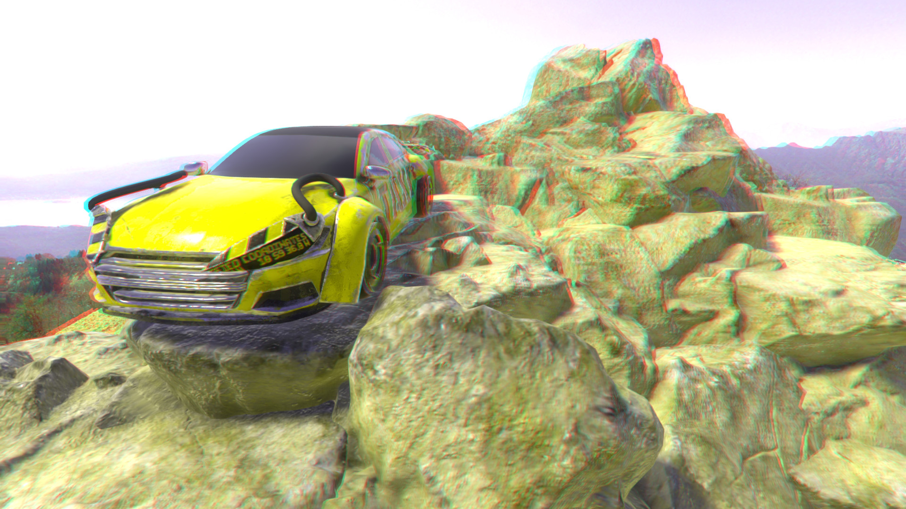
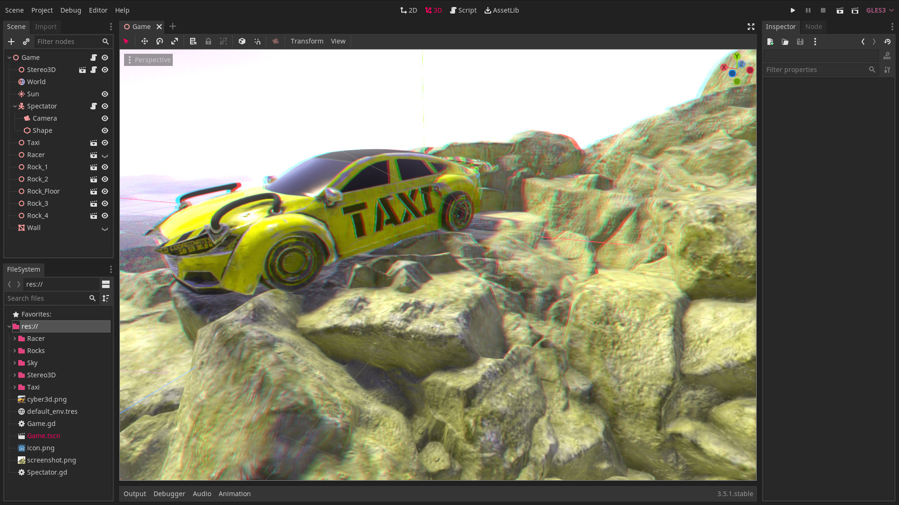

# Godot Stereo 3D : Add-On For Godot Engine
Godot Stereo 3D adds stereoscopic 3D support to Godot Engine (red/cyan anaglyph 3D glasses) in game and in editor. Works as a screen-space shader based on the depth buffer (2D to 3D conversion) so is very fast. Requires GLES3. The best 3D glasses to use with this add-on are called Pro-Ana (red/cyan). They make plastic and paper versions and are very affordable.

## INSTALLATION

[Click Here to Download the Latest Release](https://github.com/cybereality/godot-stereo-3d/releases/latest)

For manual install, download the `Stereo3D` folder from this repository and copy it into your Godot project.

## CONFIGURATION

* Place the `Stereo3D.tscn` scene inside your main game tree. 
* If used in combination with `Godot Super Scaling`, the `Stereo3D` node should be inside your game world.
* In the `Stereo3D` inspector settings, check the `Enable` box to turn stereo on or off in game or in editor.
* Set `Z Near` to the z_near of your camera.
* Set `Z Far` to the z_far of your camera.
* The `Separation` controls the distance between the eyes. `0` is no distance and `100` is the maximum.
* Setting `Separation` too high may cause discomfort, so leaving it around the default of `50` is recommended.
* The `Convergence` controls the distance to the parallax plane the eyes are focused on (on the z axis). 
* Higher values for `Convergence` will result in a greater 3D effect, but setting it too high may cause discomfort.
* The `Pop Out` setting controls the overlap between the left/right images. This makes the image more 3D or more comfortable.
* Typically lower `Pop Out` settings are easier to focus on. However, if you use transparent surfaces or reflections (e.g. glass windows) then it is better to set `Pop Out` to the maximum so that the transparent pass closer matches the 3D render.
* If you have overlapping transparent surfaces in your game, you need to set the `Render Priority` of the transparent material to `1` or above (for example, in a racing game, viewed from the 3rd person, the front window could have `Render Priority` of `0` and the back `1`).
* For cut-out textures (like decals or grass) the `Render Priority` should be above `0`, the `Depth Draw Mode` set to `Opaque Pre-Pass`, `Transparent` set to false, and enable `Use Alpha Scissor` on the material. If the decal texture is on top of a transparent material (e.g. a sticker on a window) then the `Depth Draw Mode` must be set to `Never`.
* If you use reflection probes, the reflections will be captured with the results of the post-process and will be incorrect. In these cases, you should leave the `Stereo3D` disabled in game, then on _ready() in your game, wait a certain amount of time (enough for the captures to take place) before enabling `Stereo3D`.
* You must control whether `Stereo3D` is enabled or not within the inspector settings for the add-on. The eye icon in the tree is disabled by design.
* Note, since this is a post-process effect (2D to 3D conversion) and not a true dual camera stereo render, you may see some artifacts (typically halos around objects or duplicated textures). This is unavoidable with a screen-space shader, and is why it performs so fast. Changing the `Stereo3D` settings so that the 3D effect is less can mitigate some of these artifacts.

## LICENSE

MIT License

Copyright (c) 2021 Andres Hernandez

Permission is hereby granted, free of charge, to any person obtaining a copy
of this software and associated documentation files (the "Software"), to deal
in the Software without restriction, including without limitation the rights
to use, copy, modify, merge, publish, distribute, sublicense, and/or sell
copies of the Software, and to permit persons to whom the Software is
furnished to do so, subject to the following conditions:

The above copyright notice and this permission notice shall be included in all
copies or substantial portions of the Software.

THE SOFTWARE IS PROVIDED "AS IS", WITHOUT WARRANTY OF ANY KIND, EXPRESS OR
IMPLIED, INCLUDING BUT NOT LIMITED TO THE WARRANTIES OF MERCHANTABILITY,
FITNESS FOR A PARTICULAR PURPOSE AND NONINFRINGEMENT. IN NO EVENT SHALL THE
AUTHORS OR COPYRIGHT HOLDERS BE LIABLE FOR ANY CLAIM, DAMAGES OR OTHER
LIABILITY, WHETHER IN AN ACTION OF CONTRACT, TORT OR OTHERWISE, ARISING FROM,
OUT OF OR IN CONNECTION WITH THE SOFTWARE OR THE USE OR OTHER DEALINGS IN THE
SOFTWARE.
